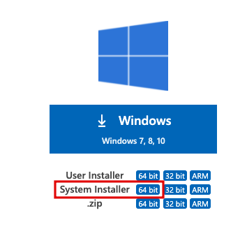
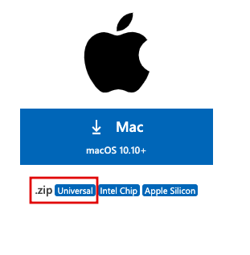
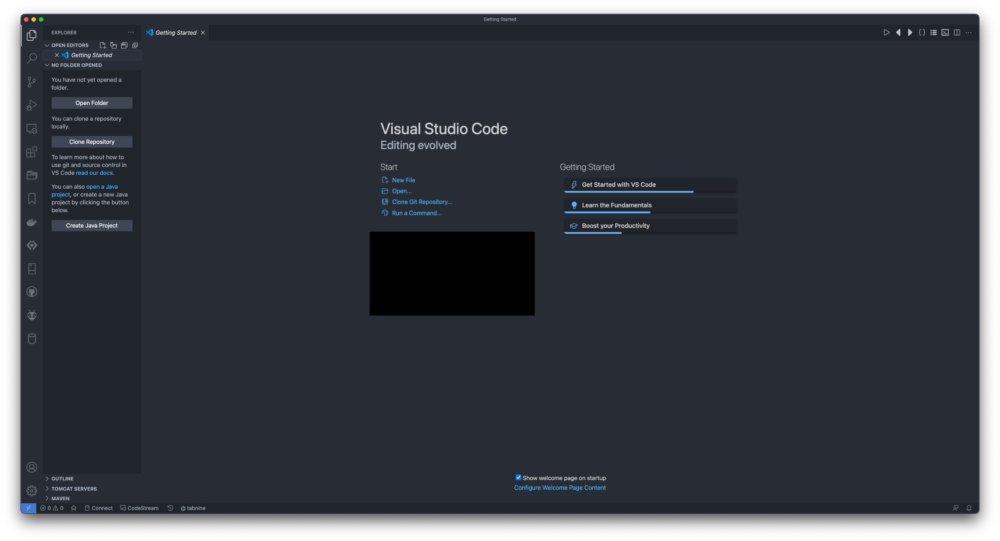
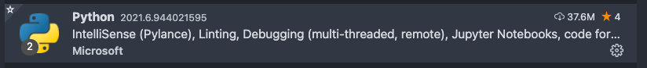
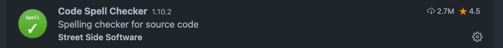
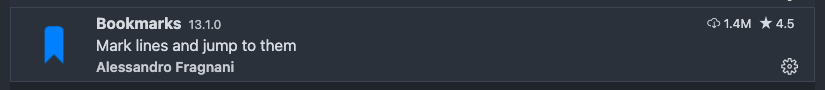
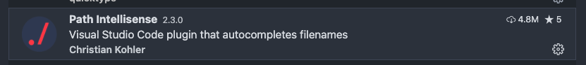
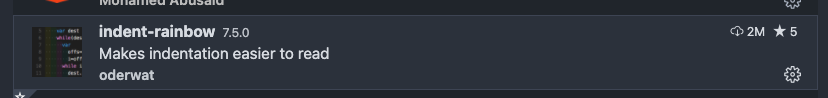

# Visual Studio Code Setup

Visual Studio Code (a.k.a VS Code) is a free source code editor by Microsoft, which is designed to be customizable and lightweight for your development project needs. It does so by installing a bare bones source code editor with language features right out of the box, and providing a rich market place for you to have a powerful programming experience.

>Note: Please proceed with this ONLY if you have installed Python on your system. If you have not done so yet, please follow our [guide](python-setup.md) on how to install python on your machine.

## What is a source code editor?

Wikipedia has a definition. You can find it [here](https://en.wikipedia.org/wiki/Source-code_editor)

## What is this guide?

This guide provides you with a quick way to setup visual studio code and get you started with installing some extensions which are incredibly useful for developing with languages like Python.

## What this guide is not?

This guide is by no means an exhaustive resource on training you how to use the VS Code editor. However, it does list some links to help you get started.
I would _highly_ recommend looking at the first 4 items in the [learning section](#learn-about-vs-code) before our session.

## Table of contents

- [Visual Studio Code Setup](#visual-studio-code-setup)
  - [What is a source code editor?](#what-is-a-source-code-editor)
  - [What is this guide?](#what-is-this-guide)
  - [What this guide is not?](#what-this-guide-is-not)
  - [Table of contents](#table-of-contents)
  - [Getting VS Code](#getting-vs-code)
    - [Windows](#windows)
    - [Mac (OSX)](#mac-osx)
  - [Checking VS Code](#checking-vs-code)
  - [Learn about VS code](#learn-about-vs-code)
  - [Extensions](#extensions)

## Getting VS Code

You can download VS Code by clicking on this [link](https://code.visualstudio.com/#alt-downloads). Please see what you need to download by checking what operating system you use, below.

### Windows

Please download the "64 bit System Installer".

### Mac (OSX)

Please download the "Universal dmg".

__Run the installer, and please follow the instructions for the platform you are on. Once the installation is complete, please reboot your machine for the installation to take full effect.__

>_Note_: This is not required, but it is good to allow the installer complete any form of reboot related procedures.

## Checking VS Code

Once you have rebooted your machine, please launch VS code on your machine. You can search for it via the start menu on Windows, or using finder on Mac or Nix based systems.

You should see a blank window, with a welcome page being displayed. Your colour scheme might vary.

## Learn about VS code

1. Please start [here](https://code.visualstudio.com/docs/getstarted/introvideos) to learn VS from ground up.
2. Please refer to [this](https://code.visualstudio.com/docs/getstarted/userinterface) to get used to the user layout.
3. Please refer to [this](https://code.visualstudio.com/docs/getstarted/settings) to learn how to access various settings.
4. Please refer to [this](https://code.visualstudio.com/docs/editor/extension-marketplace) to learn more about extensions and how to install them.
5. Please refer to [this](https://code.visualstudio.com/docs/editor/codebasics) to learn basic editing.
6. Intellisense is your friend. Learn about it [here](https://code.visualstudio.com/docs/editor/intellisense).
7. Navigate your code. Please see [this](https://code.visualstudio.com/docs/editor/editingevolved) to learn more.
8. Terminal is an incredibly powerful tool. It is always great to know how to use integrated terminal in VS Code. It will allow you to code and run it in the same window without leaving VS Code. Learn more [here](https://code.visualstudio.com/docs/editor/integrated-terminal). For more information on command line interface, please check out our guide [here](../guides/command-line-interface.md)

## Extensions

We will install some useful extensions which will help us program better. Please refer to the user layout guide in the [Learn about VS Code section above](#learn-about-vs-code) section first.

To install extensions, please navigate to the extensions pane, and install the following extensions by searching for them in the search bar.

Congratulations! You have now successfully setup VS Code for some python development. You can definitely use VS Code to program for a large number of programming languages.
Please refer to [this](https://code.visualstudio.com/docs/languages/overview) to find out more.
