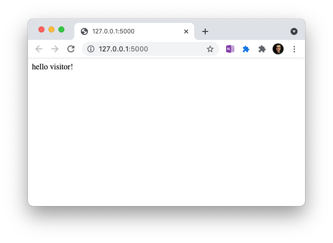
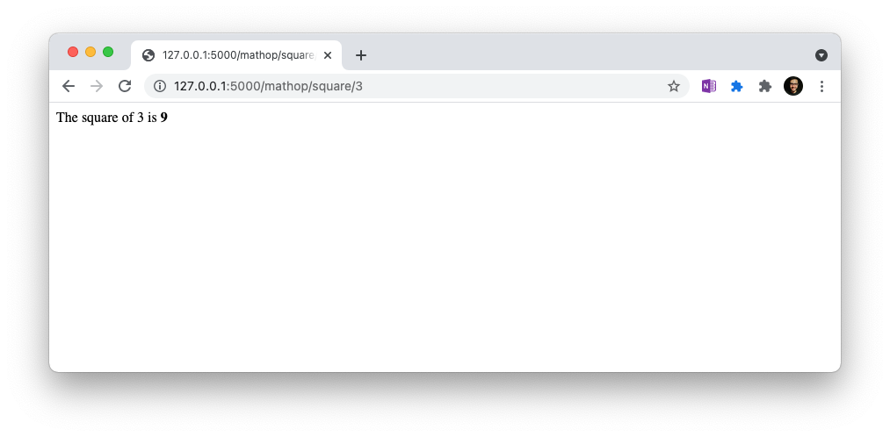
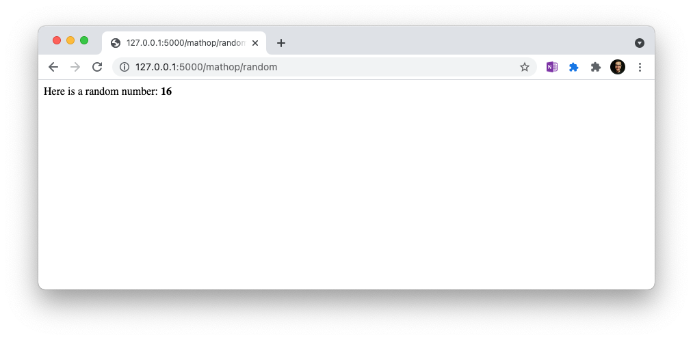

# A sample web server using Flask in Python

What is a webserver? Have a quick read [here](https://developer.mozilla.org/en-US/docs/Learn/Common_questions/What_is_a_web_server)!
[Here](https://www.educause.edu/ir/library/html/cmr9939/cmr9939.html) is a more general note about the development of the internet and websites.

Now, let us explore a very simple example of how you could build a simple webserver in Python using a module called `Flask`.

To run this webserver, you first need to install Flask on your machine. To do so, please open command prompt and type the following command

```bash
python3 -m pip install flask requests
```

if `python3` does not work for you and `python` does, please use that.

Once you have done this, you can almost run your webserver.
Before running your webserver, you have to tell your flask CLI what is the webserver you are trying to run.
To do this, you need to run the following command on your command prompt

For Mac

```bash
cd /Users/sarthaktickoo/Work/Bloombench/bootcamp/techmentry-bootcamp/src/Sample_WebServer/
set FLASK_APP=server
flask run
```

for Windows

```bash
cd C:\Work\Bloombench\bootcamp\techmentry-bootcamp\src\Sample_WebServer\
export FLASK_APP=server
flask run
```

Please note that the folder that you may have downloaded your programs in might be different than what I have shown above. Please change your directory to the appropriate one and then run your webserver.

Once you have done this, you should see something like this

```bash
 * Serving Flask app 'server' (lazy loading)
 * Environment: production
   WARNING: This is a development server. Do not use it in a production deployment.
   Use a production WSGI server instead.
 * Debug mode: off
 * Running on http://127.0.0.1:5000/ (Press CTRL+C to quit)
```

Now open your web browser (Chrome, Firefox, Safari or whatever you use), and type the following in the address bar

```text
http://127.0.0.1:5000/
```

Which will then show you this page


We have written some sample routines for you, which you can try out to see how websites work

E.g. we can get the square of the number 3 like this

```text
http://127.0.0.1:5000/mathop/square/3
```

Which will print something like this



Please change 3 to any number you like and see the results change.

We can also generate numbers randomly between 1 and 100 using this link

```text
http://127.0.0.1:5000/mathop/random
```



And if you get bored, here is something fun

```text
http://127.0.0.1:5000/get_image
```
